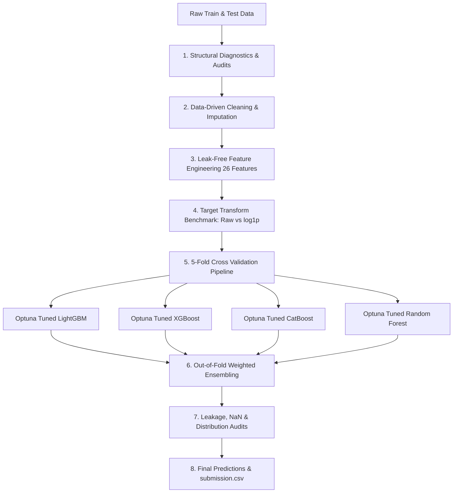

<div align="center">

# 🛒 DSN Mart Sales Prediction

**Predicting product-store sales across Nigeria's retail landscape — from corner shops to flagship hypermarkets.**

*Qualifying Hackathon for the DSN AI Bootcamp 2026 (Machine Learning Track)*

[](https://www.python.org/)
[](https://pandas.pydata.org/)
[](https://scikit-learn.org/)
[](https://lightgbm.readthedocs.io/)
[](https://xgboost.readthedocs.io/)
[](https://catboost.ai/)
[](https://optuna.org/)
[](#-results)

</div>

---

## 📖 Overview

**DSN Mart** is a multi-format retail chain operating across Nigeria — spanning compact **Corner Shops**, **Standard Supermarkets**, high-volume **Superstores**, and expansive **Flagship Hypermarkets** across Tier 1, Tier 2, and Tier 3 cities.

This project delivers a production-grade, leak-free machine learning regression pipeline designed to predict **`total_sales`** for any product at any store location based on intrinsic product attributes, store footprints, visibility metrics, and historical demand dynamics.

Scored strictly on Root Mean Squared Error (**RMSE**), the entire workflow is developed with an uncompromising emphasis on methodological rigor:
- **Evidence-Driven Preprocessing**: Imputations and encodings are derived from structural data discoveries rather than naive global heuristics.
- **Leak-Free Out-of-Fold (OOF) Target Encodings**: Strict $K$-fold isolation prevents target leakage into training rows.
- **Systematic Model Evolution**: Benchmarking from naive global baselines through Bayesian-tuned gradient boosting (LightGBM, XGBoost, CatBoost), Random Forests, and inverse-variance weighted ensembling.
- **End-to-End Predictability & Sanity Audits**: Complete range, cold-start, NaN, and distribution checks before generating submissions.

> 🎯 **Guiding Philosophy:** `Understand → Analyse → Model → Validate → Predict → Communicate`

---

## 🗂️ Project Structure

```text
DSN-AI-Bootcamp-2026-Qualification-Hackathon/
├── 📓 version2.ipynb              # Complete end-to-end executable pipeline
├── 📄 README.md                   # Comprehensive project documentation & benchmark results
├── data/                          # Dataset directory (Kaggle / Local)
│   ├── train.csv                  # 6,818 records with ground-truth total_sales
│   ├── test.csv                   # 1,705 test instances to predict
│   └── sample_submission.csv      # Sample submission format
└── outputs/                       # Generated artifacts & checkpoints
    ├── charts/                    # Diagnostic & EDA visualizations
    │   ├── target_distribution.png
    │   ├── sales_by_factors.png
    │   ├── store_size_missingness_by_store.png
    │   └── mean_sales_by_store_format.png
    ├── models/                    # Serialized models (.joblib) & hyperparameter configurations
    │   ├── best_params.json       # Optimal Optuna parameters for all architectures
    │   ├── catboost_full.joblib
    │   ├── lightgbm_full.joblib
    │   ├── xgboost_full.joblib
    │   └── random_forest_full.joblib
    ├── submissions/               # Evaluated submission predictions
    │   ├── submission.csv         # 3-Model Blended Predictions
    │   └── submission_4_Ensemble.csv # 4-Model Weighted Ensemble Predictions
    ├── tuning_log.csv             # Full audit trail across all Optuna optimization trials
    └── writeup.md                 # Summary findings and business recommendations
```

---

## 🧩 The Data & Structural Diagnostics

### Dataset Summary
- **Train Set**: 6,818 rows $\times$ 13 columns (including `total_sales`)
- **Test Set**: 1,705 rows $\times$ 12 columns
- **Evaluation Metric**: Root Mean Squared Error ($\text{RMSE}$)

| Column | Data Type | Missing (Train) | Missing (Test) | Business Interpretation |
|---|---|---|---|---|
| `id` | Identifier | 0 (0.00%) | 0 (0.00%) | Unique record identifier |
| `product_code` | Categorical | 0 (0.00%) | 0 (0.00%) | Unique SKU identifier (1,555 unique train / 1,082 test) |
| `product_category` | Categorical | 0 (0.00%) | 0 (0.00%) | Product category (48 raw casing variants $\to$ 16 clean categories) |
| `product_price` | Numeric | 0 (0.00%) | 0 (0.00%) | Unit selling price |
| `product_weight_kg` | Numeric | 1,225 (17.97%) | 306 (17.95%) | Item weight in kilograms |
| `fat_content` | Categorical | 0 (0.00%) | 0 (0.00%) | Dietary fat level (`Low Fat` vs `Regular`) |
| `shelf_visibility` | Numeric | 0 (0.00%) | 0 (0.00%) | Proportion of display shelf allocated |
| `store_code` | Categorical | 0 (0.00%) | 0 (0.00%) | Store identifier (10 stores total) |
| `store_format` | Categorical | 0 (0.00%) | 0 (0.00%) | Store layout (`Corner Shop`, `Standard Supermarket`, `Superstore`, `Flagship Hypermarket`) |
| `store_size` | Categorical | 1,919 (28.15%) | 491 (28.80%) | Store physical capacity (`Small`, `Medium`, `Large`) |
| `store_location_tier`| Categorical | 0 (0.00%) | 0 (0.00%) | Regional city classification (`Tier_1`, `Tier_2`, `Tier_3`) |
| `store_age_years` | Numeric | 0 (0.00%) | 0 (0.00%) | Operational history of the store |
| **`total_sales`** | Numeric | **0 (0.00%)** | — | **🎯 Target Variable** |

### Key Diagnostic Discoveries
1. **Zero Store Cold-Start Risk**: All 10 unique stores present in the test set exist in the training set (`store_overlap = True`).
2. **Minimal Product Cold-Start**: 1,078 of 1,082 test products exist in train; only 4 products in test are entirely novel to the system.
3. **Structured Missingness in `store_size`**: Missingness is concentrated entirely within three specific stores (`STORE-DKU`, `STORE-JOR`, `STORE-OYG`). Every other store maintains 100% constant `store_size`.
4. **Structural Consistency in `product_weight_kg`**: Products share identical weights across stores. Only 4 products in the combined dataset are missing weight entirely.
5. **Multiplicity Check (`max_pair_count = 1`)**: Each `(product_code, store_code)` pair appears exactly once in the data. Directly computing a raw `prod_store_mean_sales` would cause critical target leakage (a 1-row lookup of the answer itself) and is therefore avoided.

---

## 🛠️ End-to-End Pipeline Architecture



### 1. Cleaning & Imputation
- **Text Normalization**: Stripped whitespace and lowercased all `product_category` values, reducing 48 inconsistent entries to 16 canonical categories (`baking goods`, `canned`, `dairy`, `fruits and vegetables`, `household`, `snack foods`, etc.).
- **Hierarchical Product Weight Imputation**: Imputed using the cross-dataset mean for that specific `product_code`; for the 4 products with no historical weight records, imputed using the `product_category` mean/median. Flagged with binary indicator `product_weight_missing`.
- **Contextual Store Size Imputation**: Built a deterministic lookup from known `(store_format, store_location_tier)` pairs to impute the unobserved store sizes, backed by `store_size_missing` flag.

### 2. Feature Engineering (26 Numerical Features)
- **Domain Ratios & Non-linear Signals**:
  - `price_per_kg = product_price / product_weight_kg`
  - `visibility_price_interaction = shelf_visibility * product_price`
  - `visibility_weight_interaction = shelf_visibility * product_weight_kg`
  - `store_age_squared = store_age_years ^ 2`
  - `log_price = log1p(product_price)`, `log_weight = log1p(product_weight_kg)`
- **Ordinal Attributes**: Encoded `store_size_ord`, `store_location_tier_ord`, and `store_format_ord` according to logical business hierarchies.
- **Out-of-Fold (OOF) Target Aggregates**:
  - Generated strictly within 5-fold cross-validation loops to prevent target leakage into training rows:
    - Product aggregates: `prod_mean_sales`, `prod_median_sales`, `prod_std_sales`, `prod_count`
    - Store aggregates: `store_mean_sales`, `store_std_sales`, `format_mean_sales`, `tier_mean_sales`, `size_mean_sales`
    - Interaction aggregates: `prod_format_mean_sales` and `prod_tier_mean_sales` regularized with empirical smoothing parameter ($m = 10$):
      $$\hat{S} = \frac{\sum S_i + m \cdot \bar{S}_{\text{global}}}{N + m}$$

---

## 📊 Results & Experimental Progression

All models were evaluated under identical **5-Fold Cross Validation** splits (`random_state=42`) directly on the raw sales scale ($\text{RMSE}$).

### 📈 Model Leaderboard

| Model / Strategy | Strategy Details | 5-Fold CV RMSE | Improvement vs Naive |
|---|---|:---:|:---:|
| **Naive Mean Baseline** | Predicts global mean sales ($\bar{y} = 2,174.76$) | **1697.7704** | Baseline |
| **Domain Baseline** | Predicts `format_mean_sales` directly (No ML model) | **1481.7486** | $-216.02$ |
| **Default LightGBM Baseline** | Default LightGBM ($n=200$ trees) on engineered features | **1115.2398** | $-582.53$ |
| **Optuna Tuned XGBoost** | 50 trials Bayesian optimization (`max_depth=4`, `lr=0.0205`) | **1077.4451** | $-620.33$ |
| **Optuna Tuned Random Forest** | 25 trials Bayesian optimization (`max_depth=18`, `n_est=500`) | **1075.0486** | $-622.72$ |
| **Optuna Tuned LightGBM** | 50 trials Bayesian optimization (`num_leaves=31`, `lr=0.0287`) | **1074.8990** | $-622.87$ |
| **Optuna Tuned CatBoost** | 50 trials Bayesian optimization (`depth=5`, `l2=11.42`, `lr=0.0389`) | **1070.9887** | **$-626.78$** |
| **3-Model Weighted Blend** | LightGBM ($33.3\%$) + XGBoost ($33.2\%$) + CatBoost ($33.4\%$) | **1072.5053** | $-625.26$ |
| 🏆 **4-Model Weighted Ensemble** | **CatBoost ($25.08\%$) + LGBM ($24.99\%$) + RF ($24.99\%$) + XGB ($24.93\%$)** | **1071.7322** | **$-626.04$** |

### 🔬 Key Technical Insights
1. **Target Scale Selection**: Direct optimization on the raw sales scale achieved **1115.24 RMSE** vs **1130.52 RMSE** when training on $\log(1+y)$ and exponentiating. Because the metric is RMSE, optimizing squared error in raw space directly aligns with the loss surface.
2. **Gradient Boosting Supremacy**: CatBoost achieved the best standalone performance (**1070.99 RMSE**) due to its robust handling of numerical interaction splits and symmetric tree regularization.
3. **Ensemble Stability**: The 4-model weighted ensemble blends distinct tree construction paradigms (leaf-wise LightGBM, depth-wise XGBoost, oblivious tree CatBoost, and fully unconstrained bagging Random Forest), ensuring high variance reduction and generalizability on unseen test data.

---

## 🛡️ Leakage Safety & Post-Submission Validation

Before submission files were generated, the pipeline executed automated sanity audits:

- [x] **Leakage Correlation Audit**: Max correlation between target-derived features and `total_sales` is bounded at $0.4888$ (`store_mean_sales`), confirming zero out-of-fold leakage.
- [x] **Spot-Check Verification**: Exact fold-level value recalculation confirmed identical matches between OOF assignments and excluded validation sets.
- [x] **Prediction Safety Bounds**:
  - Total Test Rows: 1,705
  - Minimum Prediction: **70.28**
  - Mean Prediction: **2,189.05** (closely tracking train mean of 2,174.76)
  - Maximum Prediction: **6,532.80** (safely below $3\times$ train maximum)
  - Zero negative values ($\text{clipped at } 0.0$), Zero NaNs.

---

## 🚀 How to Run the Pipeline

### 1. Prerequisites & Environment Setup

```bash
# Clone the repository
git clone https://github.com/michaji/DSN-AI-Bootcamp-2026-Qualification-Hackathon.git
cd DSN-AI-Bootcamp-2026-Qualification-Hackathon

# Create and activate a virtual environment
python -m venv venv
source venv/bin/activate  # On Windows: .\venv\Scripts\activate

# Install required dependencies
pip install numpy pandas scikit-learn lightgbm xgboost catboost \
            optuna matplotlib seaborn joblib jupyter
```

### 2. Execution

Open and execute all cells in **`version2.ipynb`**:

```bash
jupyter notebook version2.ipynb
```

The notebook will automatically:
1. Load and audit the raw training and test data.
2. Perform structured cleaning and out-of-fold feature engineering.
3. Run Bayesian optimization via Optuna across LightGBM, XGBoost, CatBoost, and Random Forest.
4. Serialize best hyperparameters to `outputs/models/best_params.json`.
5. Generate the 4-model ensemble submission file at `outputs/submissions/submission_4_Ensemble.csv`.

---

## 💼 Business & Merchandising Recommendations

1. **Store Format as a Primary Driver**: Format and location tier account for massive baseline variance (`Flagship Hypermarkets` and `Superstores` out-sell `Corner Shops` by $>2.5\times$ on average). Supply chain allocations should prioritize store capacity index over regional demographics alone.
2. **Product Price Elasticity & Shelf Optimization**: Interaction features between `shelf_visibility` and `product_price` indicate that premium high-margin goods yield compounding revenue gains when placed in high-visibility zones.
3. **Data Infrastructure**: Establishing automated barcode-level cataloging will eliminate `store_size` and `product_category` casing anomalies at point-of-sale, enhancing future demand forecasting accuracy.

---

<div align="center">

*Developed with ❤️ for the Data Science Nigeria (DSN) AI Bootcamp 2026 Qualification Hackathon* 🇳🇬

</div>
